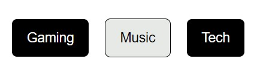

# Project Screenshots

***Project 1: Amazon Shipping Calculator***

This project features a cost calculation and display system that responds to user input.  
It incorporates an Enter key trigger for cost computation, ensuring that costs are always displayed accurately and never below $0.  
Notably, it includes a feature where costs below or equal to $40 are adjusted with a $10 minimum charge, enhancing the user experience in cost estimation.

***Project 2: Switching Modes: Toggle Buttons***

This project features a button toggle system enabling users to switch seamlessly between various modes using dedicated buttons.  
By toggling a distinctive class (button-mode-on), the system visually highlights the active mode, ensuring clarity for users.  
Additionally, it manages previous mode deactivation, ensuring that only one mode remains active at any given time for a streamlined user experience.

***Project 3: Subscribe to YouTube Channel Button***

This project showcases a dynamic Subscribe button for YouTube, demonstrating interactive web design. 
Users can click the button to toggle between 'Subscribe' and 'Subscribed' states, visually indicating their subscription status. 
The design features smooth transitions and clear visual feedback, enhancing user engagement and interaction on the web.

