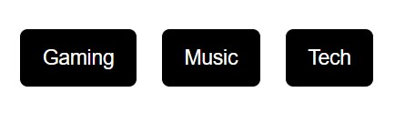
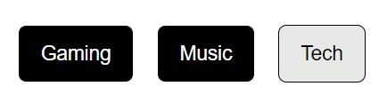

# Project Screenshots

## Project 1: My ToDo List ##

This project is a web-based productivity tool that allows users to create, display, and manage their personal todo items.  

Details

  
> The application is designed with a user-friendly interface, allowing users to effortlessly input task names along with their corresponding due dates.  
> Once entered, these tasks seamlessly integrate into a list, ensuring efficient organization and management of tasks.  
> The added tasks are displayed in a grid layout, with options to delete individual tasks as needed.

 

• Representation of Hover Effect:

 

## Project 2: Amazon Shipping Calculator ##

This project features a cost calculation and display system that responds to user input.  

Details

  
> It incorporates an Enter key trigger for cost computation, ensuring that costs are always displayed accurately and never below $0.  
> Notably, it includes a feature where costs below or equal to $40 are adjusted with a $10 minimum charge, enhancing the user experience in cost estimation.

## Project 3: Switching Modes: Toggle Buttons ##

This project features a button toggle system enabling users to switch seamlessly between various modes using dedicated buttons.  

Details

> By toggling a distinctive class (button-mode-on), the system visually highlights the active mode, ensuring clarity for users.  
> Additionally, it manages previous mode deactivation, ensuring that only one mode remains active at any given time for a streamlined user experience.

## Project 4: Subscribe to YouTube Channel ##

This project showcases a dynamic Subscribe button for YouTube, demonstrating interactive web design.  

Details

  
> Users can click the button to toggle between 'Subscribe' and 'Subscribed' states, visually indicating their subscription status.  
> The design features smooth transitions and clear visual feedback, enhancing user engagement and interaction on the web.

